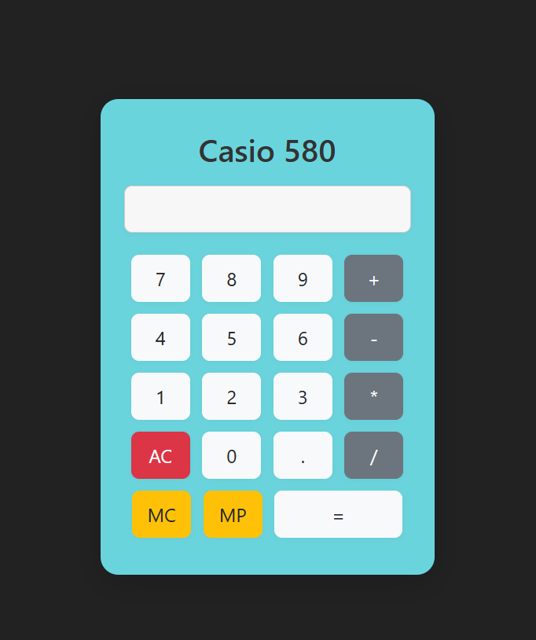

# 🧮 Calculator
Ứng dụng máy tính cầm tay - Casio 580 đơn giản được viết bằng HTML, CSS và JS

Dự án này được xây dựng nhằm luyện tập kiến thức về front-end

---
## 🚀 Demo giao diện

---
🛠️ Công nghệ sử dụng
- HTML5: xây dựng giao diện máy tính đơn giản
- CSS/Boostrap4: tạo kiểu và làm đẹp
- JS: xử lý logic tính 

