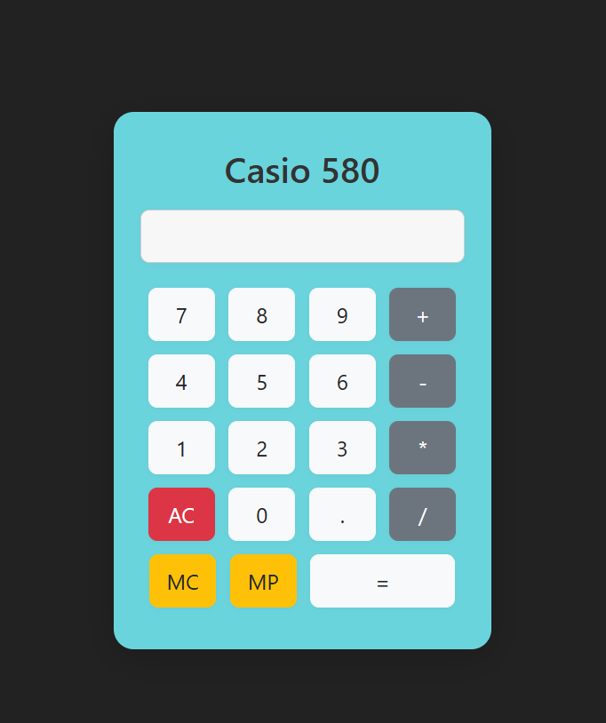

# 🧮 Calculator
Ứng dụng máy tính cầm tay - Casio 580 đơn giản được viết bằng HTML, CSS và JS

Dự án này được xây dựng nhằm luyện tập kiến thức về front-end

---
# 🚀 Demo giao diện

---
# ✨ Tính năng
- Nhập các giá trị số bằng các nút máy tính.
- Thực hiện các hoạt động toán học bằng cách chọn các nút toán tử tương ứng.
- Sử dụng nút thập phân cho đầu vào thập phân.
- Xóa đầu vào hoặc thực hiện tính toán khi cần thiết.

---
# 🛠️ Công nghệ sử dụng
- HTML5: xây dựng giao diện máy tính đơn giản
- CSS/Boostrap4: tạo kiểu và làm đẹp
- JS: xử lý logic tính 

